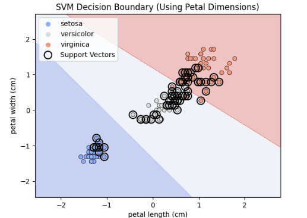
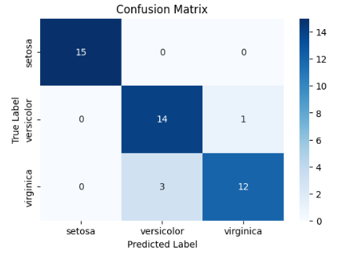

# Support Vector Machine (SVM) Classification on the Iris Dataset

[](https://www.python.org/)
[](https://scikit-learn.org/stable/)
[](https://seaborn.pydata.org/)
[](./LICENSE)
[](https://jupyter.org/)
[](https://www.kaggle.com/code/evangelosgakias/support-vector-machine-iris-dataset)
[](https://www.kaggle.com/code/evangelosgakias/support-vector-machine-iris-dataset)

---

## 🚀 Live Results

You can view the notebook with all outputs and results on Kaggle:
[https://www.kaggle.com/code/evangelosgakias/support-vector-machine-iris-dataset](https://www.kaggle.com/code/evangelosgakias/support-vector-machine-iris-dataset)

All metrics, plots, and outputs are available in the linked Kaggle notebook for full transparency and reproducibility.

---

## 📑 Table of Contents
- [Live Results](#-live-results)
- [Table of Contents](#-table-of-contents)
- [Overview](#-overview)
- [Project Structure](#-project-structure)
- [Features](#-features)
- [Quickstart](#-quickstart)
- [Usage](#-usage)
- [Results](#-results)
- [Limitations and Future Work](#-limitations-and-future-work)
- [Contributing](#-contributing)
- [License](#-license)
- [Contact](#-contact)

---

## 📝 Overview

This project presents a comprehensive machine learning workflow for classifying iris species using **Support Vector Machines (SVM)** on the classic Iris dataset. The notebook demonstrates:
- End-to-end data science best practices (EDA, preprocessing, modeling, evaluation, and interpretation)
- Professional documentation, accessibility, and reproducibility standards

**Goal:** Predict the species of iris flowers (setosa, versicolor, virginica) using four features derived from flower measurements.

This project is ideal for those seeking a clear, portfolio-ready example of multi-class classification analysis in classic machine learning datasets.

---

## 🏗️ Project Structure

```
Support Vector Machines/
├── SVM.ipynb         # Jupyter notebook with the complete implementation
├── iris.json         # Iris dataset in JSON format
├── requirements.txt  # Python dependencies
├── LICENSE           # MIT License file
├── README.md         # Project documentation (this file)
├── figure/           # Folder containing result images
│   ├── confusion_matrix.png         # Confusion matrix heatmap
│   └── svm_ decision_boundary.png   # SVM decision boundary plot
└── .gitignore        # Git ignore file for Python/Jupyter projects
```

---

## 🚦 Features

### Data Preparation
- **Dataset Loading:** Uses the scikit-learn Iris dataset (4 features, 150 samples, 3 classes)
- **Exploratory Data Analysis (EDA):** Statistical summaries, pairplots, and feature correlation analysis
- **Preprocessing:**
  - Feature scaling (StandardScaler)
  - Train/test split (70%/30%, stratified)

### Modeling
- **Support Vector Machine (SVM):**
  - scikit-learn implementation (SVC)
  - Hyperparameter tuning via GridSearchCV
  - Kernel selection (linear, RBF)
  - Pipeline for reproducibility

### Evaluation & Interpretation
- **Metrics:** Accuracy, Precision, Recall, F1-Score, Confusion Matrix
- **Visualizations:**
  - Pairplot of features
  - Decision boundary (2D, petal features)
  - Confusion matrix heatmap
- **Model Analysis:** Discussion of margin, support vectors, and kernel effects

*All plots include descriptive titles, axis labels, and are designed for accessibility.*

---

## ⚡ Quickstart

1. **Kaggle (Recommended for Reproducibility):**
   - [Run the notebook on Kaggle](https://www.kaggle.com/code/evangelosgakias/support-vector-machine-iris-dataset)
2. **Local:**
   - Clone the repo and run `SVM.ipynb` in Jupyter after installing requirements.

---

## 💻 Usage

1. **📥 Clone the repository:**
   ```bash
   git clone https://github.com/EvanGks/svm-iris-classification.git
   cd svm-iris-classification
   ```
2. **🔒 Create and activate a virtual environment:**
   - **Windows:**
     ```bash
     python -m venv .venv
     .venv\Scripts\activate
     ```
   - **macOS/Linux:**
     ```bash
     python3 -m venv .venv
     source .venv/bin/activate
     ```
3. **📦 Install dependencies:**
   ```bash
   pip install -r requirements.txt
   ```
4. **🚀 Launch Jupyter Notebook:**
   ```bash
   jupyter notebook SVM.ipynb
   ```
5. **▶️ Run all cells** to reproduce the analysis and results.

**🛠️ Troubleshooting:**
- If you encounter missing package errors, ensure your Python environment is activated and up to date.
- For best reproducibility, use the provided Kaggle link.

---

## 📊 Results

### Model Metrics
- **Best Parameters:** `{ 'C': 0.1, 'gamma': 'scale', 'kernel': 'linear' }`
- **Accuracy:** 0.9111

#### Classification Report
```
              precision    recall  f1-score   support

           0       1.00      1.00      1.00        15
           1       0.82      0.93      0.87        15
           2       0.92      0.80      0.86        15

    accuracy                           0.91        45
   macro avg       0.92      0.91      0.91        45
weighted avg       0.92      0.91      0.91        45
```

### Visualizations
- **Pairplot:** Feature relationships and class separability
- **Decision Boundary:** 2D visualization using petal length and width

  
  
- **Confusion Matrix:** Model performance on test set

  

*All plots and metrics are available in the [Kaggle notebook](https://www.kaggle.com/code/evangelosgakias/support-vector-machine-iris-dataset) for full transparency.*

---

## 📝 Limitations and Future Work
- **Linear Assumption:** SVM with linear kernel may not capture complex, non-linear relationships
- **Kernel Selection:** Choice of kernel impacts performance; RBF and polynomial kernels can be explored
- **Sensitivity to Outliers:** Real-world data may require robust preprocessing
- **Potential Improvements:**
  - Compare with other classifiers (e.g., Decision Trees, KNN)
  - Hyperparameter tuning (more exhaustive search)
  - Advanced feature engineering
  - Deploy as a web app with accessible UI

---

## 🤝 Contributing

Contributions are welcome! Please feel free to submit a Pull Request. For major changes, please open an issue first to discuss what you would like to change.

---

## 📝 License

This project is licensed under the MIT License. See the [LICENSE](./LICENSE) file for details.

---

## 📬 Contact

For questions or feedback, please reach out via:
- **GitHub:** [EvanGks](https://github.com/EvanGks)
- **X (Twitter):** [@Evan6471133782](https://x.com/Evan6471133782)
- **LinkedIn:** [Evangelos Gakias](https://www.linkedin.com/in/evangelos-gakias-346a9072)
- **Kaggle:** [evangelosgakias](https://www.kaggle.com/evangelosgakias)
- **Email:** [evangks88@gmail.com](mailto: evangks88@gmail.com)

---

Happy Coding! 🚀

<!--
Maintainer notes:
- Update badges and links as needed for your own fork or deployment.
- For new datasets or models, follow the same structure for reproducibility and clarity.
-->